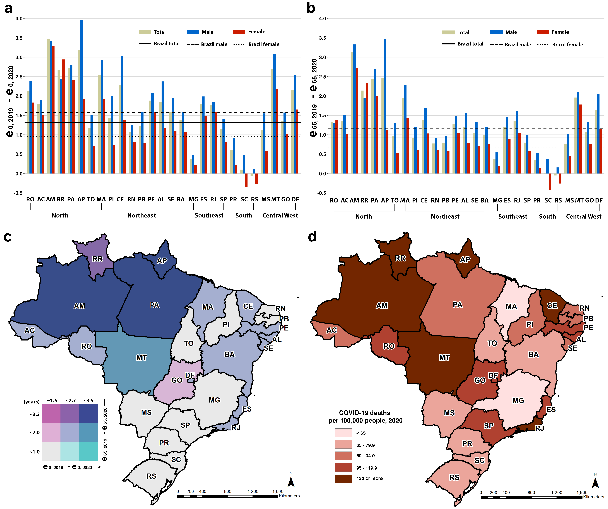

# Reduction in life expectancy in Brazil after COVID-19

Here we provide the data and pipeline for:  [Reduction in life expectancy in Brazil after COVID-19](https://doi.org/10.1038/s41591-021-01437-z)

### Citation

> Castro M.C., Gurzenda, S., Urra, C.M. et al. Reduction in life expectancy in Brazil after COVID-19. *Nat Med* (2021). https://doi.org/10.1038/s41591-021-01437-z

## Abstract

Brazil has been heavily impacted by COVID-19. We use data on reported total deaths in 2020 and in Jan-Apr 2021 to measure and compare the death toll across states. We estimate a decline in 2020 life expectancy at birth (*e0*) of 1.3 years, a mortality level not seen since 2014. The reduction in life expectancy at age 65 (*e65*) in 2020 was 0.9 year, setting Brazil back to 2012 levels. The decline was larger for males, widening by 9.1% the female-male gap in *e0*. Among states, Amazonas lost 60.4% of the improvements in *e0* since 2000. In the first four months of 2021, COVID-19 deaths represented 107% of the total 2020 figures. Assuming that death rates would have been equal to 2019 all-cause rates in the absence of COVID-19, COVID-19 deaths in 2021 have already reduced *e0* in 2021 by 1.8 years, which is slightly larger than the reduction estimated for 2020 under similar assumptions. 

__Fig. 1 Changes in life expectancy by state and sex.__  
__(a)__ Estimated change in life expectancy at birth in 2020 based on the difference from life tables calculated for 2019 and 2020 by state and sex. State acronyms by region, North: AC=Acre, AP=Amapá, AM=Amazonas, PA=Pará, RO=Rondônia, RR=Roraima, and TO=Tocantins; Northeast: AL=Alagoas, BA=Bahia, CE=Ceará, MA=Maranhão, PB=Paraíba, PE=Pernambuco, PI=Piauí, RN=Rio Grande do Norte, and SE=Sergipe; Center-West: DF=Distrito Federal, GO=Goiás, MT=Mato Grosso, and MS=Mato Grosso do Sul; Southeast: ES=Espírito Santo, MG=Minas Gerais, RJ=Rio de Janeiro, and SP=São Paulo; South: PR=Paraná, RS=Rio Grande do Sul, and SC=Santa Catarina. __(b)__ Estimated change in life expectancy at age 65 in 2020 based on the difference from life tables calculated for 2019 and 2020 by state and sex. __(c)__ Bivariate choropleth map of the estimated change in life expectancy at birth and at age 65 in 2020 based on the difference from life tables calculated for 2019 and 2020, by state. __(d)__ Number of COVID-19 deaths in 2020 per 100,000 people by state __(Methods)__.  

## Organization
For additional information see the `README.md` files in each folder: 
- `code` — Excel files for calculations for change in life expectancy associated with COVID-19  
- `data` — Data used as inputs for the life expectancy calculations  
- `figures` - All figures from the publication and the code and data used to produce them  

## Correspondence
For any issues with anonymization or major issues with the functionality of the script please [create an issue](https://github.com/mcastrolab/Brazil-Covid19-e0-change/issues).

### License
The data collected and presented is licensed under the [Creative Commons Attribution 4.0 license](https://creativecommons.org/licenses/by/4.0/), and the underlying code used to format, analyze and display that content is licensed under the [MIT license](http://opensource.org/licenses/mit-license.php). 

# Authors

- __Marcia C Castro__: Department of Global Health and Population, Harvard TH Chan School of Public Health | : [\@marciacastrorj](https://twitter.com/marciacastrorj)
- __Susie Gurzenda__: Department of Global Health and Population, Harvard TH Chan School of Public Health | : [\@susiegurzenda](https://twitter.com/susiegurzenda)
- __Cassio M Turra__: Demography Department, Cedeplar, Universidade Federal de Minas Gerais | : [\@CassioMTurra](https://twitter.com/CassioMTurra)
- __Sun Kim__: Department of Global Health and Population, Harvard TH Chan School of Public Health | : [\@SunKim0710](https://twitter.com/SunKim0710) 
- __Theresa Andrasfay__: Leonard Davis School of Gerontology, University of Southern California
- __Noreen Goldman__: Office of Population Research and Princeton School of Public and International Affairs, Princeton University
