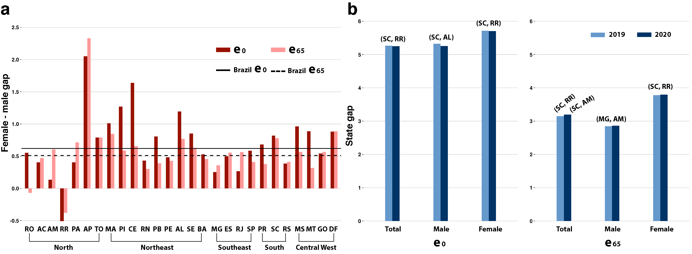
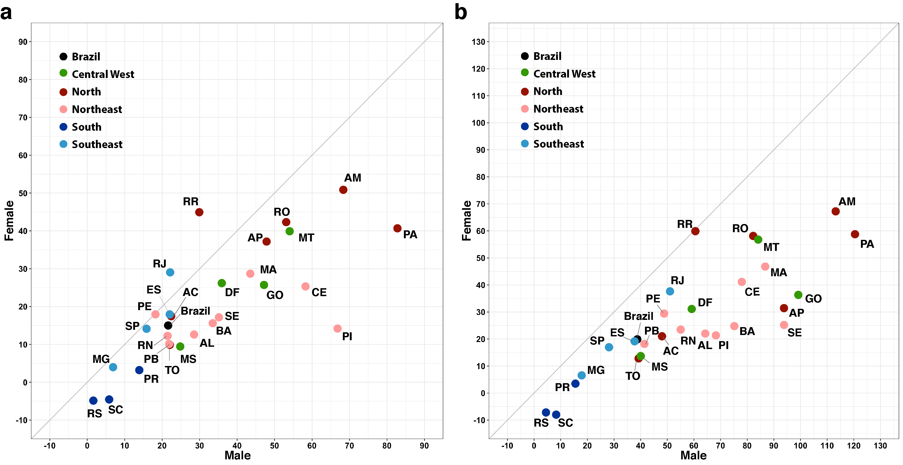
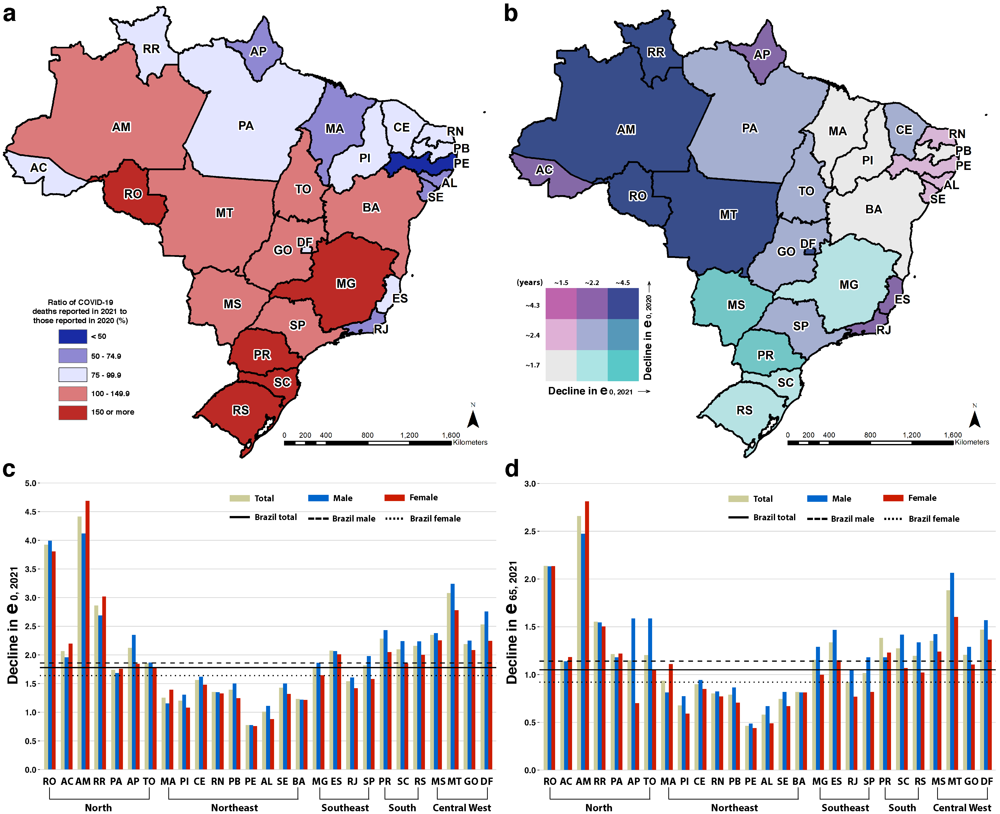

# Figures 1 - 4

Here we present Figures 1 - 4 from the manuscript.
 
Code to create the figures is presented in the `/code` folder.
 
 

### Figure 1  

__Fig. 1 Changes in life expectancy by state and sex.__
__(a)__ Estimated change in life expectancy at birth in 2020 based on the difference from life tables calculated for 2019 and 2020 by state and sex. State acronyms by region, North: AC=Acre, AP=Amapá, AM=Amazonas, PA=Pará, RO=Rondônia, RR=Roraima, and TO=Tocantins; Northeast: AL=Alagoas, BA=Bahia, CE=Ceará, MA=Maranhão, PB=Paraíba, PE=Pernambuco, PI=Piauí, RN=Rio Grande do Norte, and SE=Sergipe; Center-West: DF=Distrito Federal, GO=Goiás, MT=Mato Grosso, and MS=Mato Grosso do Sul; Southeast: ES=Espírito Santo, MG=Minas Gerais, RJ=Rio de Janeiro, and SP=São Paulo; South: PR=Paraná, RS=Rio Grande do Sul, and SC=Santa Catarina. __(b)__ Estimated change in life expectancy at age 65 in 2020 based on the difference from life tables calculated for 2019 and 2020 by state and sex. __(c)__ Bivariate choropleth map of the estimated change in life expectancy at birth and at age 65 in 2020 based on the difference from life tables calculated for 2019 and 2020, by state. __(d)__ Number of COVID-19 deaths in 2020 per 100,000 people by state __(Methods)__.
 
 
 
 
 
 

### Figure 2  

__Fig. 2 Changes in gaps of life expectancy at birth and age 65 by state and sex.__  
__(a)__ Change (in years) in the female-male gap in life expectancy at birth and age 65 based on the difference from life tables calculated for 2019 and 2020 by state and sex. Lines represent changes for Brazil. Bars, organized by major regions, show changes for the states. State acronyms by region, North: AC=Acre, AP=Amapá, AM=Amazonas, PA=Pará, RO=Rondônia, RR=Roraima, and TO=Tocantins; Northeast: AL=Alagoas, BA=Bahia, CE=Ceará, MA=Maranhão, PB=Paraíba, PE=Pernambuco, PI=Piauí, RN=Rio Grande do Norte, and SE=Sergipe; Center-West: DF=Distrito Federal, GO=Goiás, MT=Mato Grosso, and MS=Mato Grosso do Sul; Southeast: ES=Espírito Santo, MG=Minas Gerais; RJ=Rio de Janeiro, and SP=São Paulo; South: PR=Paraná, RS=Rio Grande do Sul, and SC=Santa Catarina. __(b)__ Gap (in years) in state life expectancy at birth and age 65 in 2019 and 2020, calculated as the difference between the largest and smallest life expectancy among states __(Methods)__. Labels above bars indicate the states with extreme (high, low) life expectancies in 2019 and 2020. 
 
 
 
 
 
 

### Figure 3  

__Fig. 3 Loss in life expectancy at birth and at age 65 by state and sex.__
Percentage loss due to COVID-19 mortality relative to increases in female and male life expectancy at birth __(a)__ and age 65 __(b)__ between 2000 and 2020, by state. States are colored according to major regions. State acronyms by region, North: AC=Acre, AP=Amapá, AM=Amazonas, PA=Pará, RO=Rondônia, RR=Roraima, and TO=Tocantins; Northeast: AL=Alagoas, BA=Bahia, CE=Ceará, MA=Maranhão, PB=Paraíba, PE=Pernambuco, PI=Piauí, RN=Rio Grande do Norte, and SE=Sergipe; Center-West: DF=Distrito Federal, GO=Goiás, MT=Mato Grosso, and MS=Mato Grosso do Sul; Southeast: ES=Espírito Santo, MG=Minas Gerais, RJ=Rio de Janeiro, and SP=São Paulo; South: PR=Paraná, RS=Rio Grande do Sul, and SC=Santa Catarina.

 
 
 
 
 
 

### Figure 4  

__Fig. 4 COVID-19 mortality in 2021 and changes in life expectancy by state and sex.__
__(a)__ Ratio of COVID-19 deaths reported in 2021 (Jan-Apr) to those reported in 2020 (%). Numbers above 100 indicate more deaths in 2021 than 2020. State acronyms by region, North: AC=Acre, AP=Amapá, AM=Amazonas, PA=Pará, RO=Rondônia, RR=Roraima, and TO=Tocantins; Northeast: AL=Alagoas, BA=Bahia, CE=Ceará, MA=Maranhão, PB=Paraíba, PE=Pernambuco, PI=Piauí, RN=Rio Grande do Norte, and SE=Sergipe; Center-West: DF=Distrito Federal, GO=Goiás, MT=Mato Grosso, and MS=Mato Grosso do Sul; Southeast: ES=Espírito Santo, MG=Minas Gerais, RJ=Rio de Janeiro, and SP=São Paulo; South: PR=Paraná, RS=Rio Grande do Sul, and SC=Santa Catarina. __(b)__ Bivariate choropleth map of the estimated change in life expectancy at birth in 2020 and 2021 based on the DT19 method __(Supplementary Tables 5 and 11)__. Estimated change in life expectancy at birth __(c)__ and age 65 __(d)__ in 2021.

## License
The data collected and presented is licensed under the [Creative Commons Attribution 4.0 license](https://creativecommons.org/licenses/by/4.0/), and the underlying code used to format, analyze and display that content is licensed under the [MIT license](http://opensource.org/licenses/mit-license.php). 

